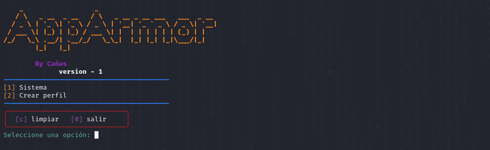

# MonAppArmor
This tool is a command-line user interface that makes it easier and more accessible to manage AppArmor profiles in Linux systems. Through an interactive menu, users can choose between two main options: get system information or create an AppArmor profile for a specific service.

The profile creation is done through a series of user questions, where the binary path of the service is requested, the entered information is displayed for verification, and finally the command is executed to generate the profile. In addition, the program uses the "colored" library to format and color the output in the terminal, and has options to clear the screen and exit the program.

In summary, this tool is useful for Linux system administrators who want to create AppArmor profiles in a simple and visual way, making it accessible to users with different levels of command-line skills.




# Status

Currently, the project is in its early stages of development, so it is only possible to check the status of the service and create profiles.

# Instalation / Instalación

To use the tool, you must first install the necessary requirements for the program to run smoothly. To do so, run the "install.sh" file from the terminal with the following command:

```bash
bash install.sh
```

Once the requirements are installed, you can run the program without any issues. To do so, simply type in the terminal:

```bash
python3 MonAppArmor.py
```
