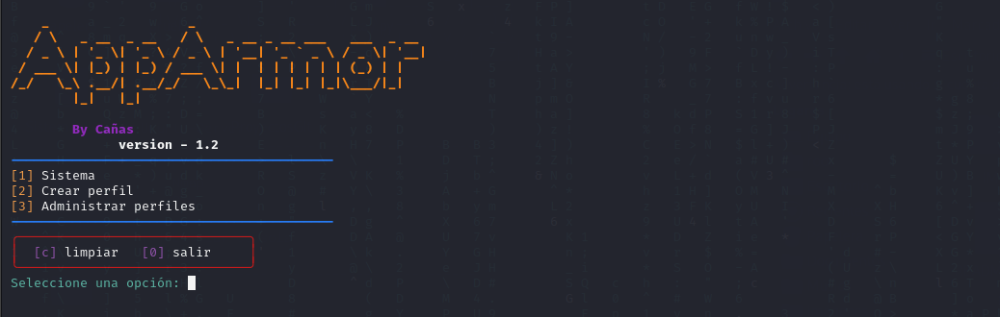

# MonAppArmor

AppArmor Interactive Tool is a cybersecurity tool for Linux that improves interactivity with AppArmor, allowing system administrators to manage security profiles more efficiently and easily.

This tool features a console user interface that simplifies the process of listing, creating, managing, deactivating, and deleting AppArmor profiles. Additionally, validations have been implemented to ensure that profile files exist before performing operations on them, reducing the likelihood of user errors and increasing system security.

AppArmor Interactive Tool is designed to enhance the management of AppArmor profiles in Linux systems and help system administrators maintain more effective control over their infrastructure's security.

In summary, this tool is useful for Linux system administrators who want to create AppArmor profiles in a simple and visual way, making it accessible to users with different levels of command-line skills.



# Status

The program is now completed and functional, but I am still working on it to improve its functionality and fix any errors or bugs that may arise. I am open to contributions and suggestions from the community to continue improving the tool and provide an effective security solution for Linux systems.

# Instalation / Instalación

To use the tool, you must first install the necessary requirements for the program to run smoothly. To do so, run the "install.sh" file from the terminal with the following command:

```bash
bash install.sh
```

Once the requirements are installed, you can run the program without any issues. To do so, simply type in the terminal:

```bash
python3 MonAppArmor.py
```
